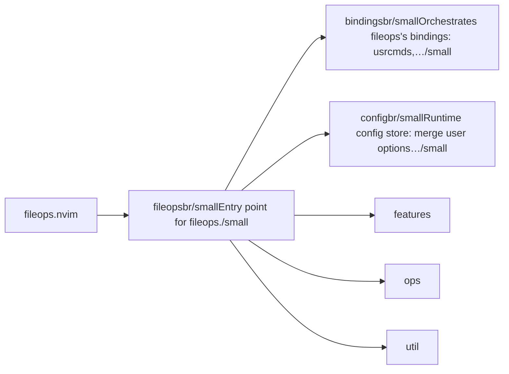
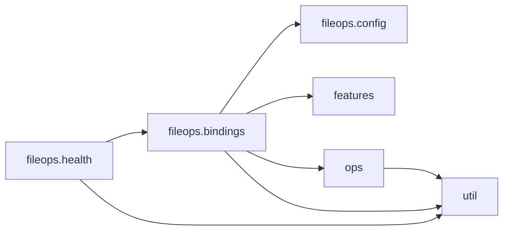

# fileops.nvim — module map

> **Generated** by `documentation`. Do not edit by hand — run `:DocMap`
> (or `nvim --headless -l scripts/gen_map.lua`) to regenerate.

**3 modules** · 4 namespaces · 13 helper files

The [interactive map](index.html) has filtering, full descriptions and
source links; this page is the version the code host renders directly.

## Namespaces

## Dependencies

Which parts of the tree require which, rolled up to the second level.
The [interactive map](index.html)'s **Deps** view has this per module,
in both directions, with load-time and lazy requires told apart.

## Modules

| Module | Description | Fns | Docs |
|---|---|---|---|
| `fileops` | Entry point for fileops. | 17 | [src](../../lua/fileops/init.lua) |
| &nbsp;&nbsp;`fileops.bindings` | Orchestrates fileops's bindings: usrcmds, keymaps, which-key. | 1 | [src](../../lua/fileops/bindings/init.lua) |
| &nbsp;&nbsp;`fileops.config` | Runtime config store: merge user options over DEFAULTS, expose get(). | 2 | [src](../../lua/fileops/config/init.lua) |
| &nbsp;&nbsp;`features` |  |  |  |
| &nbsp;&nbsp;`ops` |  |  |  |
| &nbsp;&nbsp;`util` |  |  |  |

## Drift

0 errors · 0 warnings · 4 info

No errors or warnings.

4 informational findings

| Check | Message |
|---|---|
| `missing-readme` | lua/fileops has no README.md |
| `missing-readme` | lua/fileops/bindings has no README.md |
| `missing-readme` | lua/fileops/config has no README.md |
| `unreferenced-module` | fileops.health is required by no other file in the tree |

